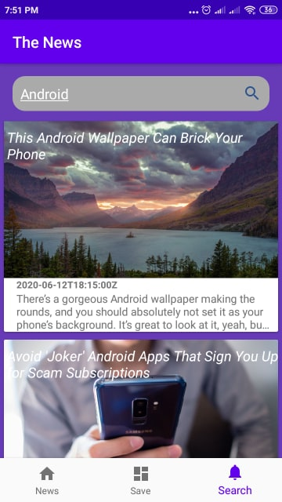

# The-News-App
show news and go to details
Using
-----
( 1-Kotin _
2-MVVM  _
3-Repository _  
4-Room  _
5-Retrofit  _ 
6-Glide  _ 
7-WebView  _ 
8-RecyclerView  _ 
9-Navigation Component ) 
 
The main goal of the program is to learn
---------------------------------------
10-Pagenation
 
https://medium.com/@harunwangereka/android-paging-library-with-kotlin-coroutines-b96602e3fae3
https://medium.com/@lukasz.marczak314/learning-paging-by-example-star-wars-195b6b3a466d
https://proandroiddev.com/playing-with-4f21bc67a7f9
https://developer.android.com/topic/libraries/architecture/paging
 
11-Coroutines 
 
https://codelabs.developers.google.com/codelabs/kotlin-coroutines/#0
https://kotlinlang.org/docs/reference/coroutines-overview.html
https://kotlin.github.io/kotlinx.coroutines/kotlinx-coroutines-core/kotlinx.coroutines/-dispatchers/index.html
https://medium.com/androiddevelopers/coroutines-first-things-first-e6187bf3bb21
 

 

